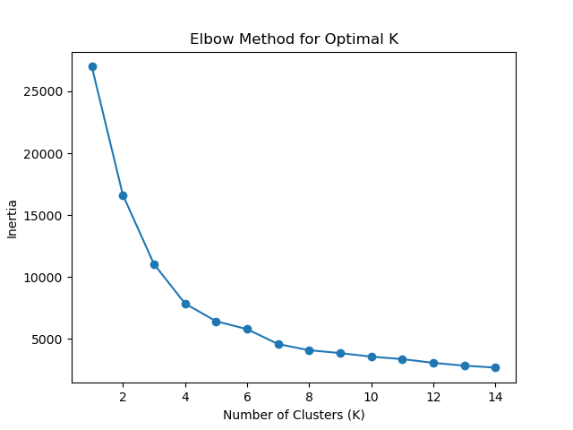
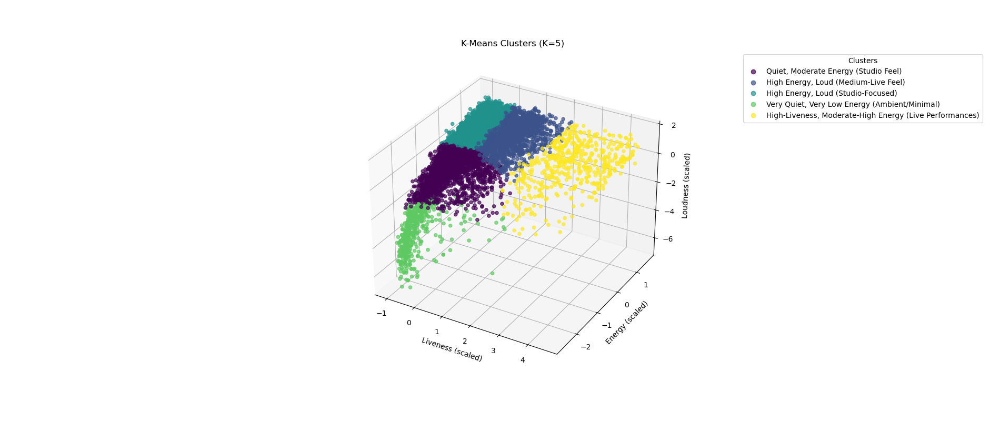
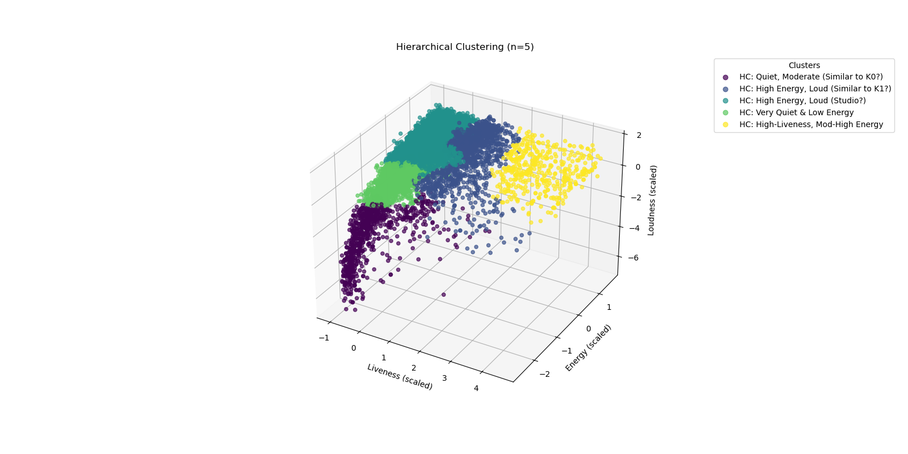
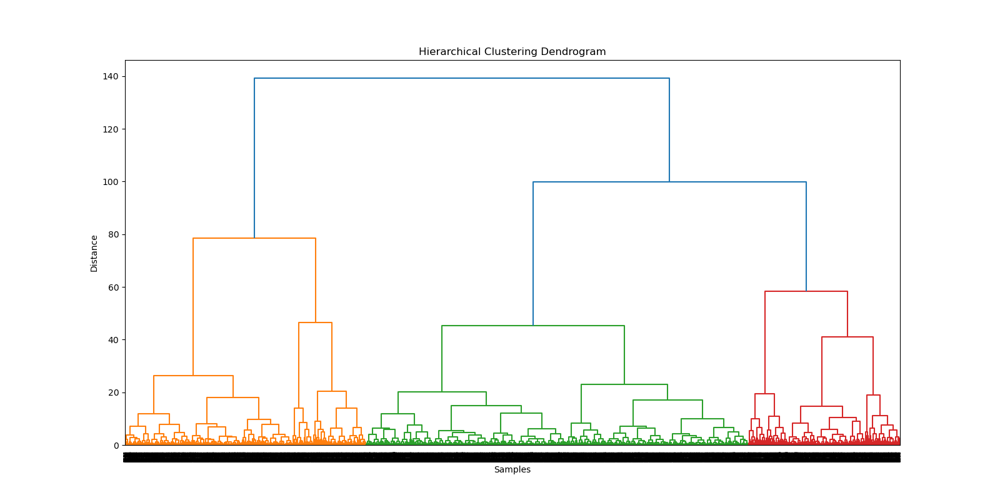

### 1. Overview

We performed clustering on music data from the Spotify–YouTube dataset, focusing on three main acoustic features:
- **Liveness**  
- **Energy**  
- **Loudness**  

Two clustering methods were employed:

1. **K-Means** with *k = 5* (determined via the elbow method).  
2. **Hierarchical Clustering** (also yielding *5* clusters for consistency and observation from dendrogram).

---

### 2. K-Means Clustering Results

#### 2.1 Elbow Method

The elbow method indicated that **5 clusters** offer a balanced trade-off between distinct group separation and avoiding excessive fragmentation. The inertia curve flattening out near *k = 5* supports this choice.



#### 2.2 K-Means Cluster Centers (Original Scale)

After scaling the features (so each contributes equally), we used K-Means and then **inverse-transformed** the resulting cluster centers back to the original scale. Below is a table of these means:

| **Cluster** | **Liveness** | **Energy** | **Loudness (dB)** |
| :---------: | :----------: | :--------: | :---------------: |
|      0      |    0.143     |   0.420    |      -11.159      |
|      1      |    0.334     |   0.779    |      -6.005       |
|      2      |    0.111     |   0.758    |      -6.014       |
|      3      |    0.126     |   0.085    |      -25.135      |
|      4      |    0.746     |   0.692    |      -7.775       |

#### 2.3 Cluster Labels for K-Means

Based on inspection of these average values, we assigned the following **descriptive labels**:

```python
cluster_labels = {
    0: "Quiet, Moderate Energy (Studio Feel)",
    1: "High Energy, Loud (Medium-Live Feel)",
    2: "High Energy, Loud (Studio-Focused)",
    3: "Very Quiet, Very Low Energy (Ambient/Minimal)",
    4: "High-Liveness, Moderate-High Energy (Live Performances)"
}
```

**Interpretations**:

1. **Cluster 0: “Quiet, Moderate Energy (Studio Feel)”**  
   - Low liveness (~0.14), moderate energy (~0.42), quieter loudness (~-11.16 dB).  
   - Typically, calmer studio tracks with a mild energy level.

2. **Cluster 1: “High Energy, Loud (Medium-Live Feel)”**  
   - Medium liveness (~0.33), high energy (~0.78), quite loud (~-6 dB).  
   - Tracks possibly well-suited to workouts or parties, with some live ambiance.

3. **Cluster 2: “High Energy, Loud (Studio-Focused)”**  
   - Lowest liveness (~0.11), high energy (~0.76), loud (~-6 dB).  
   - Similar loudness and energy to Cluster 1, but with a studio, less ‘live’ vibe.

4. **Cluster 3: “Very Quiet, Very Low Energy (Ambient/Minimal)”**  
   - Very low energy (~0.085), extremely quiet (~-25 dB), minimal liveness (~0.13).  
   - Likely ambient, acoustic, or minimalistic recordings.

5. **Cluster 4: “High-Liveness, Moderate-High Energy (Live Performances)”**  
   - Significantly higher liveness (~0.75), moderate-to-high energy (~0.69), moderately loud (~-7.78 dB).  
   - Strongly suggests live concert recordings or “live session” tracks.

---

### 3. Hierarchical Clustering Results

For comparison, we also applied **Hierarchical Clustering** (Ward linkage, Euclidean metric) and cut the dendrogram at *n = 5* clusters. While it naturally merges or splits tracks based on similarity, the overarching distribution is broadly similar to K-Means. However, the exact grouping of individual tracks can differ because hierarchical clustering does not rely on “centroids” but on incremental merging of closest items or subclusters.

#### 3.1 Hierarchical Clustering Labels

We labeled the Hierarchical clusters in a way that roughly corresponds to the K-Means categories, but recognized they may not match perfectly:

```python
legend_labels_hc = [
    "HC: Quiet, Moderate (Similar to K0?)",
    "HC: High Energy, Loud (Similar to K1?)",
    "HC: High Energy, Loud (Studio?)",
    "HC: Very Quiet & Low Energy",
    "HC: High-Liveness, Mod-High Energy"
]
```

**Observations**:
- Tracks in the **“Quiet, Moderate”** cluster share similarities with K-Means Cluster 0 (lower loudness, moderate energy).
- A **“High Energy, Loud”** cluster correlates with K-Means Clusters 1 or 2, though hierarchical might blend certain edge cases differently.
- The **“Very Quiet & Low Energy”** grouping aligns well with K-Means Cluster 3.
- A **“High-Liveness, Moderately High Energy”** group typically aligns with K-Means Cluster 4.

---

### 4. Visualizations

1. **3D Scatter Plots**  
   - **K-Means**: Each color in the 3D scatter corresponds to one of the five clusters, and the legend maps to the descriptive labels listed above.  
   - **Hierarchical**: A similar 3D visualization indicates how the five clusters form in that method.



2. **Dendrogram**  
   - Shows the incremental merging of data points into clusters in the hierarchical approach. Large vertical ‘jumps’ often signify major divisions between groups.

---

### 5. Overall Analysis and Recommendations

1. **Distinct Cluster Profiles**  
   - We effectively have five unique “sound profiles” ranging from “quiet/low-energy” to “loud/high-energy,” with an additional dimension of “liveness” indicating how ‘live’ or ‘studio-like’ each track is.

2. **Use Cases**  
   - **Cluster 1 & 2** (High energy, loud) can be recommended for workouts, parties, or energetic playlists.  
   - **Cluster 0** sits at a more moderate midpoint, possibly suited to casual listening or background contexts.  
   - **Cluster 3** is extremely quiet and low-energy, ideal for soothing or ambient environments.  
   - **Cluster 4** (high liveness) caters to those seeking the excitement of live performances.

3. **Methodological Considerations**  
   - **K-Means**: Useful for larger datasets; requires specifying K upfront.  
   - **Hierarchical**: Offers a dendrogram for more granular insight but can be expensive on very large data.  
   - In this case, both methods converge on similar musical groupings with slight differences in membership.

4. **Possible Extensions**  
   - **Additional Audio/Music Features**: Incorporate Danceability, Tempo, Valence, or spectral analyses for a more nuanced classification.  
   - **Contextual Tagging**: Label clusters according to artist or genre for deeper insights (e.g., “High-Energy Rock” vs. “High-Energy Pop”).  
   - **User Preference Modeling**: Use cluster IDs as a dimension in personalized recommendation or playlist generation.

---

### 6. Conclusions

The clustering results underline that **Liveness**, **Energy**, and **Loudness** form a concise yet effective feature set to categorize music by “atmosphere” and “intensity.” The five-cluster solution reveals a gradient from very soft, minimal tracks to highly loud, energetic, and potentially live recordings. By comparing K-Means and Hierarchical outcomes, we confirm the existence of these distinct groupings across the dataset. Ultimately, these findings can inform playlist curation, targeted recommendations, or further audio analysis efforts.